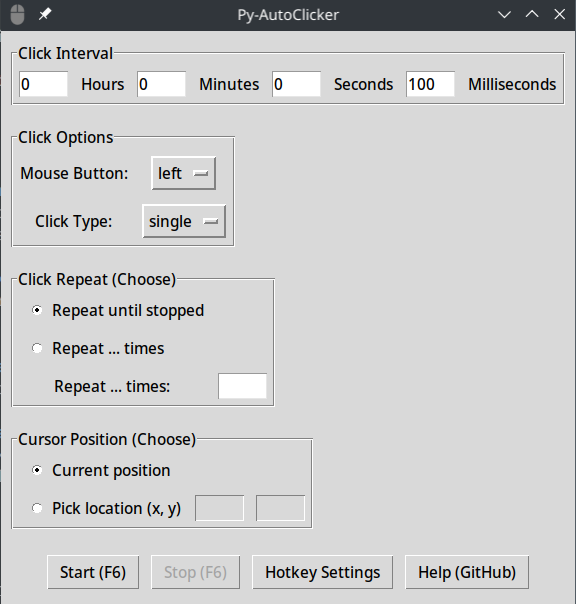

# Py-AutoClicker

Py-AutoClicker is a simple auto-clicking application built using Python and tkinter GUI library.

      


## Features

- **Click Interval**: Set intervals in hours, minutes, seconds, and milliseconds.
- **Click Options**: Choose mouse button (left, right, middle) and click type (single, double).
- **Click Repeat**: Options to repeat clicks until stopped or for a specified number of times.
- **Cursor Position**: Click at the current cursor position or pick a specific location (x, y).

## Installation

### Prerequisites

- Python 3.x installed ([Download Python](https://www.python.org/downloads/))
- Tkinter library (usually included with Python)

## Application installation


### Installation Steps
1. Clone the repository:
   ```
   git clone https://github.com/douxxu/Py-autoclicker.git
   cd Py-autoclicker
   ```

2. Run the installer and follow the instructions:
    ```
    python3 src/installer.py
    ```

---

## Cli use installation:

1. Clone the repository:
   ```
   git clone https://github.com/douxxu/Py-autoclicker.git
   cd Py-autoclicker
   ```

2. Install dependencies:
   ```
   pip install -r src/requirements.txt
   ```

3. Run the application:
   ```
   python src/Py-autoclicker.py
   ```

## Usage

1. **Set Click Parameters**:
   - Configure the click interval, button, type, repeat options, and cursor position as desired.

2. **Start AutoClicker**:
   - Click the "Start" button or use the configured hotkey (default: F6).

3. **Stop AutoClicker**:
   - Click the "Stop" button or use the configured hotkey.

4. **Hotkey Settings**:
   - Change the hotkey for starting/stopping the autoclicker by clicking "Hotkey Settings" and pressing a new key.

## Screenshots




## Contributing

Contributions are welcome! Fork the repository and submit a pull request.

1. Fork the project ([Fork Py-AutoClicker](https://github.com/douxxu/Py-autoclicker/fork))
2. Create your feature branch (`git checkout -b feature/AmazingFeature`)
3. Commit your changes (`git commit -am 'Add some feature'`)
4. Push to the branch (`git push origin feature/AmazingFeature`)
5. Open a pull request

## License

This project is licensed under the MIT License - see the [LICENSE](LICENSE) file for details.


